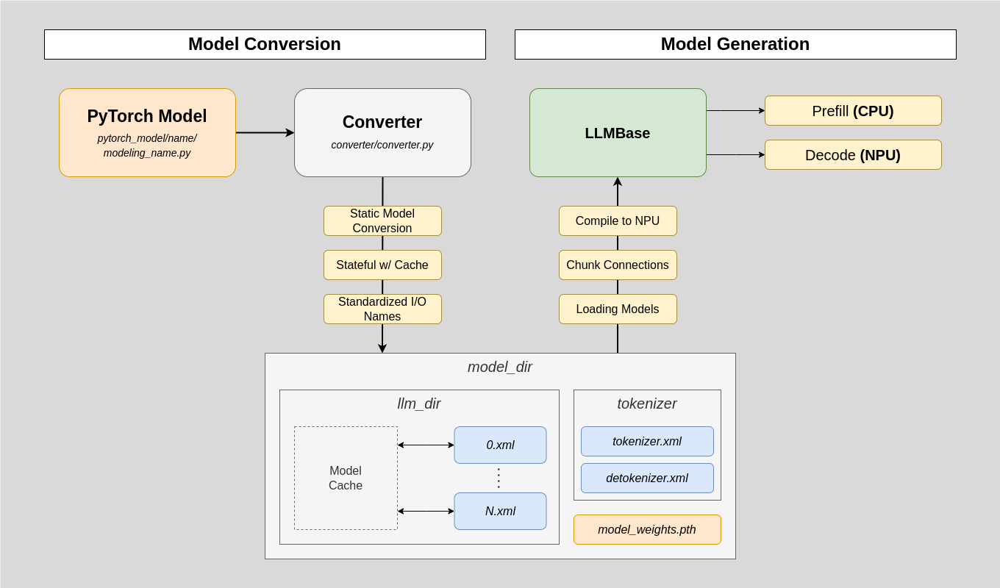

# NITRO: NPU Inference for Transformers Optimization
This package aims to serve LLMs with inference on Intel Neural Processing Units
(NPUs) on Intel Core Ultra Processors, utilizing the OpenVINO toolkit. Because
NPUs currently do not support LLMs, some modifications have been made.



## Developer Notes
This package has been validated on the Meteor Lake processor, with the Linux NPU
Driver 1.6.0 and OpenVINO 2024.3.0. Currently, the frameworks supports Llama3,
with some initial support for Qwen2.

# Installation

First, clone the repository:
```
git clone https://github.com/abdelfattah-lab/nitro.git
cd nitro
```
Then, in the top-level directory, run:
```
python setup.py install
pip install .
```
Then, install PyTorch of your choice. For instance, to install PyTorch for only
CPU, run
```
pip install torch --index-url https://download.pytorch.org/whl/cpu
```
# Getting Started

Import the Llama model:
```python
from nitro import LlamaPipeline
```
## Exporting the Model
Use the `from_pretrained` function, which will export the OpenVINO IR model and compile to the NPU (or CPU/GPU, if specified). There are three different configuration classes:

**ModelConfig** - the settings for the exporting.
| Parameter          | Description                                                                                         |
|--------------------|-----------------------------------------------------------------------------------------------------|
| pretrained_model: *(str)* | The name of the model, as defined in Hugging Face.|
| model_dir: *(str)*| The specified folder to save the loaded model information.|
| max_seq_len: *(int)*| The maximum sequence length.|
| export: *(bool)*| Whether to generate the model from scratch. If not, the OpenVINO IR models will be used directly. It checks if `pretrained_model` matches the specified model in `model_dir/config.json`. |
| do_chunk: *(bool)*| Whether to chunk the model into embedding, decoder chunks, and final FC layer. If not, the entire model will be converted as one OpenVINO IR model.                                                                  |
| chunk_size: *(int)*| Size of each decoder layer chunk. The size must be a factor of the total number of decoder layers.|

**GenerationConfig** - the settings for generation.
| Parameter          | Description                                                                                         |
|--------------------|-----------------------------------------------------------------------------------------------------|
| device: *(str)* | What device to compile the model on. Uses OpenVINO's compile tool to check whether the device is detected or not. |
| do_sample: *(bool)*| Whether to sample in text generation. If set to false, generation will use greedy sampling. |
| temperature: *(float)*| Temperature of sampling: smaller values are more deterministic, larger values are more random. Ignored if `do_sample` is False. |

**VerboseConfig** - the settings for output logs. Currently just one boolean, but finer configurations will be provided in a later release.

| Parameter| Description|
|--------------------|-----------------------------------------------------------------------------------------------------|
| verbose: *(bool)* | Whether to output status information in the command line. |

Below is an example of exporting the pretrained model Llama3-8B:
```python
# Model configurations for exporting and converting
model_config = ModelConfig(
    pretrained_model="meta-llama/Meta-Llama-3-8B",
    model_dir="llama_8",
    max_seq_len=128,
    export=True,
    do_chunk=True,
    chunk_size=16,
    compress=CompressWeightsMode.INT8_ASYM
)

# Generation process after exporting model
generation_config = GenerationConfig(
    device="NPU",
    do_sample=False,
    temperature=1.0
)

# Print statement configurations
verbose_config = VerboseConfig(
    verbose = False
)

llama = LlamaPipeline.from_pretrained(model_config,
                                      generation_config,
                                      verbose_config)
```

This will create the folder `openvino_llama` in the working directory.

## Text Generation
The `generate()` function enables text generation:
```python
prompt=["The weather outside is super cold, but"]
out = llama.generate(prompt, max_new_tokens=30)
print(prompt[0] + out)
```
To generate with the same model without rebuilding the model, set the `export` parameter to False.

## Chat Generation
The `chat_generate()` function will enable a REPL loop in the command line, enabling you to ask questions with a chatbot.
```python
llama.chat_generate(max_new_tokens=30)
```

# Developer Information

This section aims to document the motivation, architecture, and components of NITRO.

## Simplified PyTorch Models
NITRO is centered around `ov.convert_model` from PyTorch to OpenVINO IR form. Models provided by Hugging Face utilize booleans and NoneTypes frequently and, as a result, are not very friendly for OpenVINO conversion, and consequently model conversions with Optimum are prone to certain restrictions. As a result, we are re-engineering and simplifying popular model structures to support OpenVINO conversion.

The major simplifications include:
- Input/Outputs for torch modules are tensors only, or data structures that contain tensors only (e.g. lists, tuples, or dictionaries). In the latter section, we must be careful.
- Caches are represented by tensors.
- Input names are standardized: `x`, `position_ids`, `mask`, and `kv_caches` (which is a dictionary of tensors).
- Output names are standardized: there are `x` and `logits`.

## Model Conversion
Unfortunately, model conversion is not as simple as calling `ov.model_convert`. Empirically, an 8B parameter model cannot be compiled all at once on the NPU: even with RAM of 96 GB, memory runs out. To overcome this, we introduce the concept of *chunking* - breaking down the model into smaller pieces and compiling them individually. For instance, a chunking strategy that has been validated includes compiling the embedding and final linear layer separately, and compiling the 32 transformer layers on Llama-3-8B in groups of 16 (i.e. two chunks).

Even this wasn't enough: compiling them all at once also threw an error. However, our solution involves the OpenVINO model cache: we first "warm up" each chunk by compiling and deleting the object one at a time. Then, with a cached model, compilation uses less resources and allows us to compile the entire model. In the LlamaPipeline class, we then interface the different models together.

Note: We tested a full compilation of Llama3-8B with OpenVINO 2024.3, which still killed.
